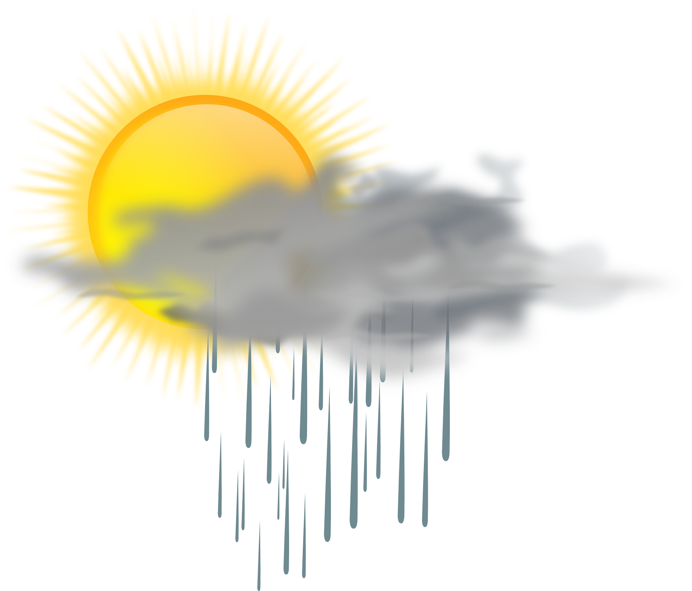

# Weather Application 🌤️

This weather application is designed with simplicity, utilizing HTML, CSS, and JavaScript to deliver real-time weather updates every hours, for any location of your choice.

## Getting Started

### 1. Changing the Location

To personalize the application with your preferred city's weather:

- Navigate to the `conf.json` file in the application's root directory.
- Open `conf.json` and locate the  `"apiKey": "YOUR_API_KEY"` and `"cityName": "CITY"` entry.
- Replace `"YOUR_API_KEY"` with an api key freely obtainable on [OpenWeatherMap](https://openweathermap.org/), and `"CITY"` with the name of your chosen city. For example, `"cityName": "Bordeaux"`.

### 2. Updating the Background Image

Actually it's personnalised for "Bordeaux", so, to change the background image to match your chosen location :

- Go to the `css` folder.
- Open the `style.css` file.
- Find the section on top where the background image URL is specified and replace it with the URL of your chosen image. Ensure the new image fits well with the application's theme and enhances the user experience.

## Support

If you encounter any issues or have questions about the application, please open an issue on the GitHub repository, and i'll be happy to help.

Now you just have to enjoy your personalized weather application 🌸

_(The current image is copyright-free, on [Pixabay](https://pixabay.com/fr/) by JonathanRieder)_
